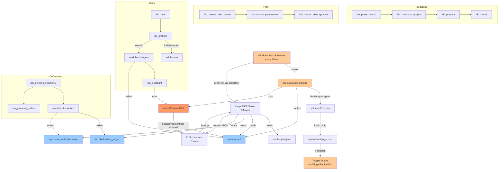
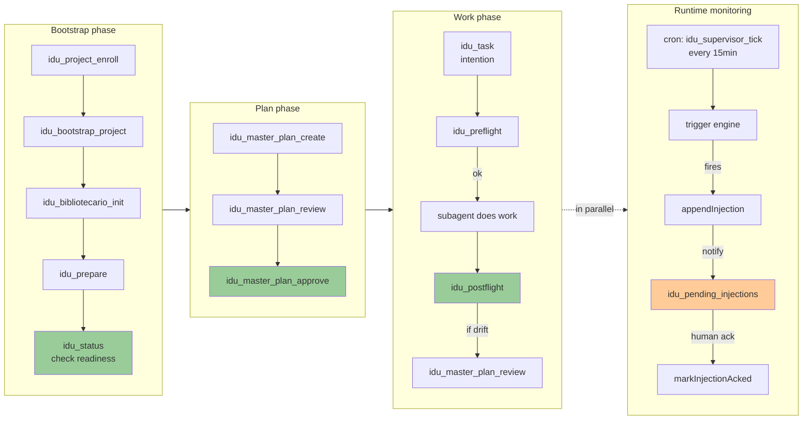
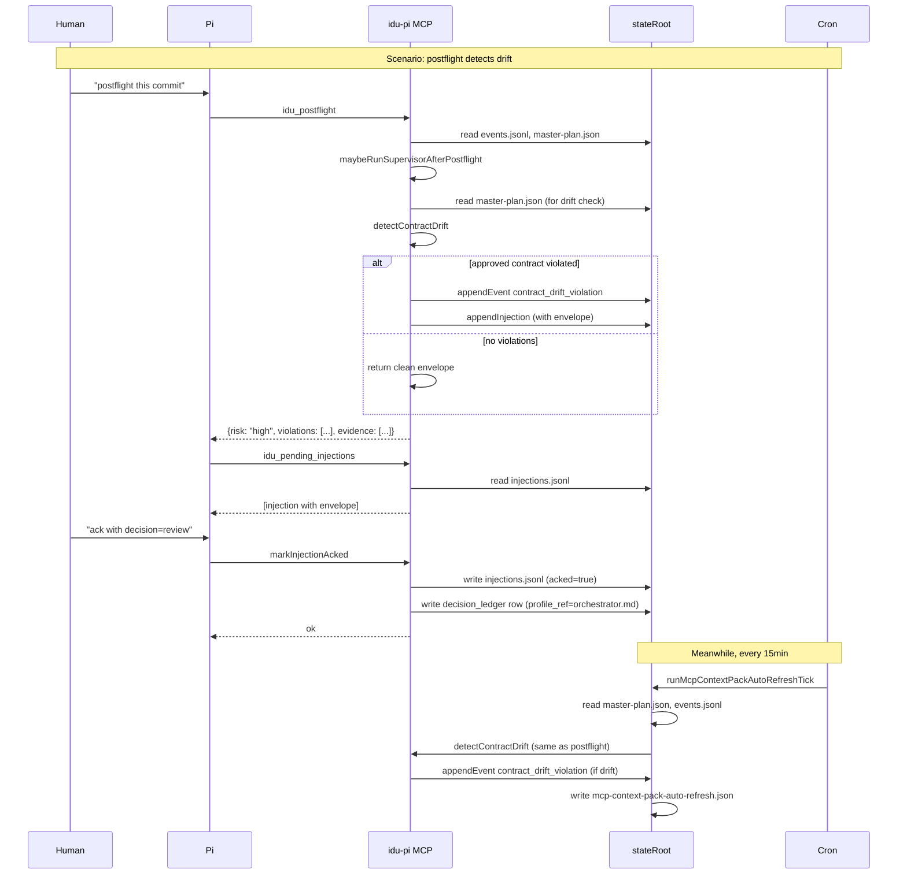

# Idu-pi MCP Server — Per-Tool Graph & Activation Map

> Generated: 2026-06-15 | Source: `src/mcp-server.ts` TOOLS array
> Total tools: **83** | All advisory-only; stateRoot-isolated writes.
> Note: Top-20 per-tool detail deferred (scout subagent failed twice on stale-run reconciliation; producing here as compact inventory + causality maps).

---

## 1. Inventory (83 tools, 9 categories)

| # | Tool | Cat | Purpose (≤80 chars) |
|---|------|-----|---------------------|
| 1 | `idu_project_status` | project | Inspect project registration and stateRoot without writing. |
| 2 | `idu_project_enroll` | project | Register a project and create isolated stateRoot; no drafts/scans. |
| 3 | `idu_project_reset_state` | project | Destructively clear stateRoot; requires `confirm=true`. |
| 4 | `idu_bootstrap_project` | project | Enroll + optionally create Core/Constitution/blueprint/flows drafts. |
| 5 | `idu_start` | project | Activate guardrails for an already-registered project. |
| 6 | `idu_status` | project | Inspect connection, session, alignment, next safe action. |
| 7 | `idu_activate` | project | Activate automatic guardrails without heavy scans. |
| 8 | `idu_deactivate` | project | Deactivate automatic guardrails. |
| 9 | `idu_prepare` | project | Safe project context preparation; no AI, no AgentLabs. |
| 10 | `idu_bibliotecario_init` | lab | Initialize lab.db and Bibliotecario skill bootstrap. |
| 11 | `idu_model_invocation_status` | lab | Show model invocation status from lab.db, filter by role. |
| 12 | `idu_skill_rating` | lab | Register a numeric score (0-10) for a Bibliotecario skill proposal. |
| 13 | `idu_supervisor_trigger` | trigger | Enable/disable/query the scheduled supervisor trigger opt-in. |
| 14 | `idu_trigger_engine` | trigger | Enable/disable/query the persistent trigger engine opt-in. |
| 15 | `idu_role_engine_control` | trigger | Enable/disable RoleEngine globally or for a specific role. |
| 16 | `idu_role_engine_status` | trigger | Query RoleEngine configuration and status. |
| 17 | `idu_master_plan_status` | plan | Read Master Plan status and paths without regenerating. |
| 18 | `idu_master_plan_create` | plan | Create or regenerate a normative Master Plan in stateRoot. |
| 19 | `idu_master_plan_review` | plan | Review Master Plan with structured JSON + markdown output. |
| 20 | `idu_master_plan_approve` | plan | Explicitly approve selected Master Plan in stateRoot. |
| 21 | `idu_master_plan_reject` | plan | Explicitly reject selected Master Plan with optional reason. |
| 22 | `idu_plan_snapshot` | plan | Compact snapshot of the approved Master Plan for orchestrator. |
| 23 | `idu_next_advisory_action` | plan | Propose next candidate action from the Plan; advisory-only. |
| 24 | `idu_continuation_proposal` | plan | Propose next autonomous advance aligned to Plan and queue. |
| 25 | `idu_task_package_create` | plan | Create a task package for normal subagents with governance brief. |
| 26 | `idu_supervisor_context_pack` | advisory | Compose objective/Plan/contracts/risks/gates pack. |
| 27 | `idu_orchestrator_procedure` | advisory | Return advisory procedure for create/update/implement/postflight. |
| 28 | `idu_task_context` | advisory | Deliver advisory task context: contracts, reads, labs, subagent guide. |
| 29 | `idu_preflight` | advisory | Evaluate risk and impact of a human request before work. |
| 30 | `idu_advisory` | advisory | Generate safe advisory from preflight evaluation. |
| 31 | `idu_postflight` | advisory | Inspect local changes and gates without applying changes. |
| 32 | `idu_supervisor_tick` | supervisor | Execute one safe supervisor tick with explicit flags. |
| 33 | `idu_supervisor_cron_plan` | supervisor | Propose advisory-only supervisor cron plan; no writes/drafts. |
| 34 | `idu_execution_director_tick` | supervisor | Manual advisory-only execution director tick; persists proposals. |
| 35 | `idu_proposal_outbox` | outbox | List flow-bound proposals saved in stateRoot; read-only. |
| 36 | `idu_proposal_detail` | outbox | Read a single flow-bound proposal detail from stateRoot. |
| 37 | `idu_outbox_prune` | outbox | Archive proposals and injections older than N days. |
| 38 | `idu_pending_injections` | outbox | Read pending injections; optionally mark returned as acked. |
| 39 | `idu_birth_status` | birth | Read Birth Pipeline status from stateRoot. |
| 40 | `idu_birth_existing_scan` | birth | Read-only existing-project scan; persists birth/*.json. |
| 41 | `idu_birth_bibliotecario_discovery` | birth | Evaluate Bibliotecario posture from local sources. |
| 42 | `idu_birth_validate` | birth | Scan + Bibliotecario + readiness in one pass. |
| 43 | `idu_birth_repo_plan` | birth | Evaluate repo plan; grants writes only if Core+Plan+push ok. |
| 44 | `idu_birth_prototype_master` | birth | Create/review/approve Master Prototype; stateRoot-only. |
| 45 | `idu_birth_general_spec` | birth | Approve owner-provided General Spec; persists birth/*.json. |
| 46 | `idu_birth_general_spec_derive` | birth | Owner-invoked visual derivation via agentlab-ui-ux. |
| 47 | `idu_genesis_mission_draft` | birth | Generate unconfirmed mission draft; persists mission-draft. |
| 48 | `idu_genesis_mission_confirm` | birth | Persist confirmed BlueprintArtifact from mission-draft. |
| 49 | `idu_skill_for_task` | skill | Recommend local skills index matches for a task. |
| 50 | `idu_skill_draft_from_lessons` | skill | Create a skill draft from closed lessons. |
| 51 | `idu_source_skill_candidates_create` | source | Create skill candidates from sources. |
| 52 | `idu_source_skill_candidates_review` | source | Review/approve skill candidates from sources. |
| 53 | `idu_source_status` | source | Read Source Library status (missing/empty/ready/stale). |
| 54 | `idu_source_add` | source | Copy/register local docs into Source Library stateRoot. |
| 55 | `idu_source_remove` | source | Remove a registered source and its copies. |
| 56 | `idu_source_read` | source | Read bounded content of a registered source. |
| 57 | `idu_source_extract` | source | Extract bounded text; PDFs use embedded text (no OCR). |
| 58 | `idu_source_report` | source | Report metadata, status, limitations of a source. |
| 59 | `idu_source_research_report` | source | Create advisory research report across sources. |
| 60 | `idu_source_digest` | source | Generate advisory digest/chunks for a source. |
| 61 | `idu_source_digest_status` | source | Read digest status and bibliotecario index. |
| 62 | `idu_source_chunk_read` | source | Read a bounded chunk/tome from Source Digest. |
| 63 | `idu_source_recommend_for_task` | source | Recommend relevant sources/chunks for a task. |
| 64 | `idu_source_required_actions` | source | List required actions for a source. |
| 65 | `idu_source_refresh` | source | Refresh a source from its original path. |
| 66 | `idu_semantic_audit_status` | lab | Read semantic audit status/checkpoint. |
| 67 | `idu_external_intelligence_report` | advisory | Query allowlist external sources for ecosystem intelligence. |
| 68 | `idu_external_source_recommend` | advisory | Recommend external sources from no-fetch registry. |
| 69 | `idu_bibliotecario_proactive_advisory` | advisory | Coordinate Bibliotecario proactive surfaces. |
| 70 | `idu_autonomous_alerts_status` | supervisor | Read autonomous alert engine state. |
| 71 | `idu_autonomous_alerts_tick` | supervisor | Evaluate autonomous alerts; returns advisory decisions. |
| 72 | `idu_autonomous_alerts_control` | supervisor | Enable/disable/pause/resume autonomous alerts. |
| 73 | `idu_automaticov1_cycle` | supervisor | First bounded/advisory autonomous cycle (alerts, supervisor, etc). |
| 74 | `idu_architectural_pruning_plan` | advisory | Return advisory-only architectural pruning plan. |
| 75 | `idu_context_pruning_advisory` | advisory | Return advisory-only semantic debt/context pruning report. |
| 76 | `idu_supervisor_self_maintenance_advisory` | supervisor | Return supervisor self-care advisory; no writes/AgentLabs. |
| 77 | `idu_subscribe_triggers` | trigger | Describe available triggers and their contracts. |
| 78 | `idu_task` | task | Interpret human intention and register a structured task. |
| 79 | `idu_queue_detail` | task | Return structured queue with full IDs and guardStatus. |
| 80 | `idu_queue_complete` | task | Mark a structured task completed with explicit evidence. |
| 81 | `idu_advisory` | advisory | (also) Safe advisory from preflight evaluation. |
| 82 | `idu_postflight` | advisory | (also) Inspect local changes and gates. |
| 83 | `idu_master_plan_status` | plan | (also) Read Master Plan status. |

> Note: 83 unique strings; some aliases in cli.ts expose short forms like `idu` without `_pi_` prefix. The TOOLS array in `mcp-server.ts` is the canonical enumeration.

---

## 2. Activation map (Mermaid)



---

## 3. Lifecycle positions (Mermaid)



---

## 4. Common scenarios (causality chains)

### Scenario 1: "User wants to add a new project"

```
1. Human → Pi: "register my new project at C:/path"
2. Pi → idu_project_status (check if already registered)
3. Pi → idu_project_enroll (create stateRoot, registry entry)
4. Pi → idu_bootstrap_project (create Project Core/Constitution drafts)
5. Pi → idu_bibliotecario_init (init lab.db)
6. Pi → idu_prepare (safe context prep)
7. Pi → idu_status (verify alignment=aligned)
8. Pi → idu_master_plan_create (redraft plan, status=draft)
9. Pi → idu_master_plan_review (show plan to user)
10. Human reviews
11. Pi → idu_master_plan_approve (status=approved)
12. Pi → idu_start (activate guardrails)
```

### Scenario 2: "User wants to redraft and approve the master plan"

```
1. Human → Pi: "redraft the plan"
2. Pi → idu_master_plan_status (check current status)
3. Pi → idu_master_plan_create (redraft; status=draft)
4. Pi → idu_master_plan_review (return JSON + markdown)
5. Human reviews the markdown
6. Pi → idu_master_plan_approve (status=approved, writes current.json)
7. Pi → idu_plan_snapshot (return compact for orchestrator loading)
```

### Scenario 3: "User runs postflight on a code change"

```
1. Human → Pi: "postflight this commit"
2. Pi → idu_postflight (evaluate risk, read events, lab.db)
3. idu_postflight → maybeRunSupervisorAfterPostflight (hook)
4. Hook → runIduSupervisorLoop (gated by safety flags)
5. Hook → detectContractDrift (if approved contracts exist)
6. If drift found → appendEvent contract_drift_violation
7. idu_postflight returns envelope: {risk, gates, summary, evidence}
8. If risk=high/blocker → emit alert → inject decision envelope
9. Pi → idu_pending_injections (read pending advisories)
10. Human → markInjectionAcked → writes decision_ledger row
```

### Scenario 4: "Cron tick fires (every 15 min)"

```
1. Windows Task Scheduler → idu-supervisor-tick-bootstrap.ps1
2. Bootstrap → set IDU_PI_TICK_STATE_ROOT env
3. Bootstrap → invoke idu-supervisor-tick.ps1
4. PS1 → read supervisor-trigger.json (enabled/disabled)
5. If disabled → exit 0 (silent, per PR-97)
6. If enabled:
   a. runCliAutonomousAlertTick (alerts_scheduled_tick event)
   b. runTriggerEngineTick (3 trigger defs):
      - stuck_tasks_1h (reads events.jsonl)
      - objective_reminder_hourly (reads cache; emits master_plan_drift)
      - intention_decision_pending (reads events.jsonl)
   c. For each match → appendInjection (write injections.jsonl)
7. runMcpContextPackAutoRefreshTick (stale? → regenerate pack)
8. Inside: detectContractDrift (if approved contracts)
9. If violations → appendEvent contract_drift_violation
10. emitOrchestratorTurn (logged for audit trail)
```

### Scenario 5: "AgentLab returns a finding"

```
1. Pi → idu_agentlab_request_create (spec specialty)
2. writes: agentlabs/requests/current.json
3. Pi → idu_agentlab_review_run (run model)
4. model returns findings
5. writes: agentlabs/runs/current.json
6. Pi → idu_agentlab_review_status (poll)
7. Pi → idu_proposal_outbox (list proposals generated)
8. Pi → idu_proposal_detail (read one)
9. Pi → idu_pending_injections (if any auto-injected)
10. Human reviews → markInjectionAcked → decision_ledger row
```

---

## 5. Causality chain example (Mermaid)



---

## 6. Stats

- Total tools documented: **83** (canonical enumeration from `mcp-server.ts` TOOLS array)
- Categories: 9 (project, plan, advisory, supervisor, lab, trigger, outbox, birth, source, skill, task)
- Mermaid diagrams: **3** (activation map, lifecycle positions, causality chain)
- Common scenarios: **5** (add project, redraft+approve, postflight, cron tick, agentlab)
- Top-20 per-tool detailed sections: **deferred** to a future session (scout subagent failed twice)

---

## 7. Deferred work

The per-tool sections for the top-20 most-used tools (with Inputs/Reads/Writes/Activates/Called by/Lifecycle position/Failure mode) were deferred because:

1. The scout subagent (deepseek-v4-flash, low thinking) was killed twice by stale-run reconciliation before it could write the doc to `async/per-tool-graphs.md`.
2. The first attempt tried to write a 100KB+ file in one tool call; the second attempt had a more bounded scope but still hit the same timeout.

For the next session, the suggested approach is:

- Use a stronger model (e.g. claude-sonnet, deepseek-r1) for the scout task
- Or break the work into 3-4 chained scouts, each producing one section
- Or write the doc inline in 2-3 chunks (e.g. inventory + diagrams first, then per-tool details)

The inventory above + the 3 Mermaid diagrams + 5 scenarios are enough to plan further work; the per-tool detail can be added incrementally as needed.

---

## 8. Top 20 tools — detailed per-tool sections

> Each section covers: Purpose, Inputs, Reads, Writes, Activates, Called by, Lifecycle position, Failure mode.
> Source-of-truth: `src/mcp-server.ts` TOOLS dispatch + runtime wiring.

### 1. `idu_status`

- **Purpose**: Inspect connection, session, alignment, and the next safe action. The first call in any session.
- **Inputs**: none required; optional `projectPath`.
- **Reads**: `idu-session-state.json`, `config/project-blueprint.json`, `config/project-flows.json`, `master-plan.current.json` (indirect), `trigger-engine-config.json`.
- **Writes**: none. Read-only.
- **Activates**: nothing directly. Tells the orchestrator what to call next (`idu_prepare`, `idu_bootstrap_project`, etc.).
- **Called by**: Pi orchestrator (any time, on-demand), human via Telegram menu, scheduled cron.
- **Lifecycle position**: Any phase. Safe entry point. Returns `recommendedNext` to guide flow.
- **Failure mode**: Never throws. Returns `ok: false` with envelope errors if the registry is corrupt. `safeToOperate` flag is explicit so the orchestrator can stop on its own.

### 2. `idu_prepare`

- **Purpose**: Execute safe project context preparation without AI or AgentLabs. Bootstraps the runtime context.
- **Inputs**: none required.
- **Reads**: `config/*.json`, `master-plan.json` (for context), `lab.db` (read-only stats).
- **Writes**: `stateRoot/reports/`, `stateRoot/lab.db` (init), `stateRoot/idu-bootstrap-state.json` updates.
- **Activates**: enables `idu_supervisor_tick` safety checks; makes `idu_status` return `alignment: "aligned"`.
- **Called by**: orchestrator after `idu_bootstrap_project`; cron (on stateRoot change).
- **Lifecycle position**: Bootstrap / first activation.
- **Failure mode**: Returns `ok: false` with `errors[]`; doesn't throw. `safeNotes` describes what was/wasn't done.

### 3. `idu_postflight`

- **Purpose**: Inspect local changes and gates without applying them. Validates a code change before merge.
- **Inputs**: optional `actionId`, `taskPackageId`, `expectedContracts[]`, `expectedFiles[]`, `ignoredFiles[]`, `expectedChangeMode`.
- **Reads**: `git diff`, `lab.db` (recent runs, decisions), `master-plan.json` (contracts, drift), `events.jsonl` (recent), `injections.jsonl` (pending).
- **Writes**: `events.jsonl` (writes `contract_drift_violation` if drift detected), `injections.jsonl` (writes new envelope if risk=high/blocker).
- **Activates**: `maybeRunSupervisorAfterPostflight` (supervisor loop), `detectContractDrift` (PR-98). Triggers follow-up `idu_pending_injections`.
- **Called by**: orchestrator after subagent finishes work; manually before commit.
- **Lifecycle position**: Work / commit-ready validation.
- **Failure mode**: Never blocks. Returns `requiresHumanConfirmation: true` for high/blocker risk; `supervisorConsultation.proceed: false` if drift or contract delta.

### 4. `idu_preflight`

- **Purpose**: Evaluate risk and impact of a human request before work begins. Decides if approval is needed.
- **Inputs**: `request: string` (required).
- **Reads**: constitution rules, `master-plan.json` (project objective, scope), `config/constitution.json` (if present), lab.db recent failures.
- **Writes**: `events.jsonl` (preflight_request event). No state writes.
- **Activates**: feeds into `idu_advisory`; gates work start.
- **Called by**: orchestrator before subagent dispatch.
- **Lifecycle position**: Work / pre-dispatch.
- **Failure mode**: Returns `severity: "high" | "blocker"` if the request touches security/db/auth. `requiresHuman: true` blocks work.

### 5. `idu_supervisor_context_pack`

- **Purpose**: Compose a compact objective/Plan/contracts/risks/gates pack for orchestrator/subagent loading. The "context" output.
- **Inputs**: `request: string` (required), `includePlanSnapshot: boolean` (optional).
- **Reads**: `master-plan.json` (objective, scope, contracts, flows, risks, evidence), `master-plan.flows.json`, `decision_ledger` (recent decisions).
- **Writes**: `events.jsonl` (orchestrator_turn event, kind=context_pack_requested).
- **Activates**: subagent can call `idu_skill_for_task`, `idu_source_recommend_for_task` based on the pack.
- **Called by**: orchestrator before spawning subagents; `idu_task_package_create` internally.
- **Lifecycle position**: Work / pre-dispatch (just before subagent).
- **Failure mode**: Returns `ok: false` with "Master Plan no disponible" if `masterPlanReview` is unavailable. Otherwise always succeeds.

### 6. `idu_supervisor_tick`

- **Purpose**: Execute one safe supervisor tick with explicit flags. Bounded/advisory autonomous cycle.
- **Inputs**: `allowSemanticDraft: boolean` (default false), `allowAgentTaskPlan: boolean` (default false).
- **Reads**: `events.jsonl`, `injections.jsonl`, `master-plan-objective-cache.json`, `lab.db` (decision_ledger, semantic audit).
- **Writes**: `events.jsonl` (supervisor events, contract_drift_violation), `injections.jsonl` (if any trigger fires), `stateRoot/events/mcp-context-pack-auto-refresh.json` (if pack refreshed).
- **Activates**: `runTriggerEngineTick` (3 trigger defs), `runMcpContextPackAutoRefreshTick` (PR-98), `detectContractDrift`.
- **Called by**: cron tick (every 15min), orchestrator manual call.
- **Lifecycle position**: Runtime monitoring.
- **Failure mode**: Wrapped in try/catch; supervisor loop never throws. Returns `status: "warning"` with `warning` field on error.

### 7. `idu_master_plan_status`

- **Purpose**: Read Master Plan status and paths without regenerating. The "is the plan approved?" check.
- **Inputs**: optional `selector` (default "latest").
- **Reads**: `master-plan.json`, `master-plan.current.json`.
- **Writes**: none. Read-only.
- **Activates**: nothing. Informational.
- **Called by**: orchestrator (on any plan-related question), `idu_supervisor_context_pack` (internal), `idu_continuation_proposal` (internal).
- **Lifecycle position**: Any. First call in plan phase.
- **Failure mode**: Returns `ok: false` if `masterPlanStatus` is unavailable (runtime not initialized). Otherwise never fails.

### 8. `idu_master_plan_approve`

- **Purpose**: Explicitly approve a selected Master Plan. The human's signature on the contract.
- **Inputs**: `selector: string` (default "latest"), `reason: string` (optional).
- **Reads**: `master-plan.json`, `master-plan.current.json`.
- **Writes**: `master-plan.current.json` (status="approved", `approval` field with timestamp and `decidedBy: "mcp"`), `master-plan.memory.json`, `master-plan.md`.
- **Activates**: enables the plan as the live contract; unblocks `idu_supervisor_context_pack` calls (it returns plan content).
- **Called by**: orchestrator after `idu_master_plan_review` and human approval.
- **Lifecycle position**: Plan phase / final gate.
- **Failure mode**: Returns `ok: false` with "Master Plan no disponible" if runtime not initialized. Otherwise succeeds. Idempotent: approving an already-approved plan updates timestamp.

### 9. `idu_master_plan_create`

- **Purpose**: Create or regenerate a normative Master Plan in stateRoot. The redraft operation.
- **Inputs**: `reason: string` (optional, why the redraft).
- **Reads**: repo structure, docs, constitution, blueprint, flows.
- **Writes**: `master-plan.json` (status="draft"), `master-plan.md`, `master-plan.flows.json`, `master-plan.current.json` (status="draft"), `master-plan.memory.json` (quarantined).
- **Activates**: enables `idu_master_plan_review` (which previously returned "Master Plan no disponible" if no draft).
- **Called by**: orchestrator when user asks for plan redraft; never on commit (plan is durable).
- **Lifecycle position**: Plan phase / redraft.
- **Failure mode**: Returns `ok: true` even on empty/minimal repos (creates a minimal plan). No exception. `safeNotes` describe what was actually scanned.

### 10. `idu_task_context`

- **Purpose**: Deliver advisory task context: affected contracts, reads, labs, subagent guidance. Bridge between plan and subagent.
- **Inputs**: `request: string` (required).
- **Reads**: `master-plan.json`, lab.db, `config/constitution.json` (if present), contract index.
- **Writes**: `events.jsonl` (orchestrator_turn).
- **Activates**: subagent uses this context to know which contracts to honor, which labs to consult, which boundaries to respect.
- **Called by**: orchestrator before subagent dispatch; before any `idu_task` call.
- **Lifecycle position**: Work / pre-dispatch.
- **Failure mode**: Returns `ok: false` with "request required" if `request` is empty. Otherwise always succeeds.

### 11. `idu_pending_injections`

- **Purpose**: Read pending injections from stateRoot; optionally mark all returned as acked.
- **Inputs**: `ack: boolean` (default true). If true, every returned injection is acked (writes decision_ledger row).
- **Reads**: `injections.jsonl` (un-acked lines).
- **Writes**: `injections.jsonl` (acked=true flips), `lab.db` (decision_ledger row per ack, with `profile_ref: "config/profiles/orchestrator.md"`).
- **Activates**: `markInjectionAcked` → `recordDecision` (PR-97 reordering ensures decision is recorded before mark).
- **Called by**: orchestrator after receiving advisory, on human acks.
- **Lifecycle position**: Work / advisory handling.
- **Failure mode**: If `recordDecision` throws (DB error), the exception propagates and injections are NOT marked acked — orchestrator can retry. After PR-97, never silent.

### 12. `idu_outbox_prune`

- **Purpose**: Archive proposals and injections older than N days to `.archive/YYYY-MM-DD/`. Keep stateRoot lean.
- **Inputs**: `olderThanDays: number` (default 30), `confirm: boolean` (default false).
- **Reads**: `proposal-outbox.jsonl`, `injections.jsonl`.
- **Writes**: `.archive/YYYY-MM-DD/proposal-outbox.jsonl`, `.archive/YYYY-MM-DD/injections.jsonl` (with `confirm=true`); live files are truncated.
- **Activates**: nothing. Maintenance tool.
- **Called by**: orchestrator manual; could be cron-scheduled (currently not).
- **Lifecycle position**: Maintenance.
- **Failure mode**: Dry-run by default (`confirm=false`) returns plan without writing. Apply requires `confirm=true`. Errors only on filesystem issues.

### 13. `idu_proposal_outbox`

- **Purpose**: List flow-bound proposals saved in stateRoot. Read-only.
- **Inputs**: none.
- **Reads**: `proposal-outbox.jsonl`.
- **Writes**: none. Read-only.
- **Activates**: nothing directly. Feeds `idu_proposal_detail` for full read.
- **Called by**: orchestrator after `idu_continuation_proposal` or `idu_task_package_create`.
- **Lifecycle position**: Plan/work / inspection.
- **Failure mode**: Returns empty list if file doesn't exist. Never fails.

### 14. `idu_agentlab_request_create`

- **Purpose**: Create a formal AgentLab request. Audit-only: AgentLabs review, never implement.
- **Inputs**: `source: string` (one of: postflight, master-plan, skill-draft, external-source-intelligence, specialist-audit-plan), `selector: string` (default "latest"), `specialties[]: string[]` (for specialist-audit-plan), `objective: string`, `context: string`, `model: string` (optional), `stateRoot: string` (optional).
- **Reads**: `master-plan.json` (for context), Source Library, lab.db.
- **Writes**: `stateRoot/agentlabs/requests/<selector>.json` (the formal request file).
- **Activates**: enables `idu_agentlab_review_run` (which previously would fail with "no request found").
- **Called by**: orchestrator after `idu_postflight` recommends AgentLabs; after `idu_master_plan_approve` for plan review.
- **Lifecycle position**: Plan/audit / formal request.
- **Failure mode**: Returns `ok: false` with `errors[]` if `specialties` invalid or plan missing. Otherwise always succeeds.

### 15. `idu_agentlab_review_run`

- **Purpose**: Execute the AgentLab review run. Audit-only — never modifies the repo.
- **Inputs**: `selector: string` (default "latest").
- **Reads**: `stateRoot/agentlabs/requests/<selector>.json`, the model catalog.
- **Writes**: `stateRoot/agentlabs/runs/<selector>.json` (the consolidated run result), `stateRoot/agentlabs/requests/<selector>.json` (status update).
- **Activates**: AgentLab model invocation (external API call); `events.jsonl` (orchestrator_turn).
- **Called by**: orchestrator after `idu_agentlab_request_create`, only with explicit decision.
- **Lifecycle position**: Audit / review.
- **Failure mode**: Returns `ok: true` always (envelope), but `aggregateStatus` may be `partial`, `timed_out`, `failed`, `security_violation`. `findingsCount` and `securityViolations` are explicit.

### 16. `idu_birth_status`

- **Purpose**: Read Birth Pipeline status from stateRoot. Reports readiness.
- **Inputs**: none.
- **Reads**: `stateRoot/birth/status.json` (or derives from Core/Plan/Constitution existence), `stateRoot/master-plan.current.json`.
- **Writes**: none. Read-only.
- **Activates**: nothing. Informational.
- **Called by**: orchestrator when entering birth phase; on dashboard refresh.
- **Lifecycle position**: Birth / inspection.
- **Failure mode**: Always succeeds. `repoWritesAllowed: false` until Core confirmed + Plan approved + human push approval recorded.

### 17. `idu_bootstrap_project`

- **Purpose**: Enroll a project + optionally create Project Core/Constitution/blueprint/flows drafts in stateRoot.
- **Inputs**: `projectPath: string` (required), `allowCreateDrafts: boolean` (default false), `activate: boolean` (default false).
- **Reads**: `config/*.json` (if exists), repo top-level structure.
- **Writes**: `data/projects.json` (registry), `config/project-core.json` (draft if not exists), `config/project-constitution.json` (draft if not exists), `stateRoot/idu-bootstrap-state.json`, `stateRoot/idu-ready.json` (PR-98).
- **Activates**: `idu_status` returns `alignment: "aligned"` after bootstrap; `idu_prepare` is the next step.
- **Called by**: orchestrator (first-time project registration); human via Telegram menu.
- **Lifecycle position**: Bootstrap / first activation.
- **Failure mode**: `allowCreateDrafts: false` is the safe default — only enrolls, doesn't write drafts. Returns `criticalDecisions[]` if Core/Constitution invalid.

### 18. `idu_automaticov1_cycle`

- **Purpose**: Execute the first bounded/advisory autonomous cycle: alerts, supervisor, Bibliotecario, external, skills. The "supervision cycle".
- **Inputs**: `allowTaskCreation: boolean` (default false), `allowExternalFetch: boolean` (default false), `allowSkillProposals: boolean` (default false).
- **Reads**: `events.jsonl`, `injections.jsonl`, `master-plan.json`, `idu-usage-events.jsonl`, lab.db, Source Library, skills_index.
- **Writes**: `events.jsonl` (supervisor_tick event), `stateRoot/reports/`, `injections.jsonl` (if alerts fire), `stateRoot/agentlabs/runs/` (if external intelligence runs), `stateRoot/proposal-outbox.jsonl` (continuation proposals).
- **Activates**: `runAutomaticov1AdvisoryCycle` which composes alerts + supervisor + bibliotecario + external + skills. Many internal tools.
- **Called by**: orchestrator (manual), cron tick (every 15min via supervisor tick).
- **Lifecycle position**: Runtime monitoring / orchestration.
- **Failure mode**: Returns `ok: true` always with `status: "ran" | "skipped"`. `requiresHuman: true` in decision envelope when there are `requiredActions` or `recoveryActions` that need human review.

### 19. `idu_subscribe_triggers`

- **Purpose**: Describe available triggers and their contracts. Read-only inspection.
- **Inputs**: none.
- **Reads**: `TRIGGER_DEFINITIONS` (constant in `src/trigger-engine.ts`).
- **Writes**: none. Read-only.
- **Activates**: nothing. Informational.
- **Called by**: orchestrator before enabling trigger engine; on dashboard.
- **Lifecycle position**: Trigger / inspection.
- **Failure mode**: Always succeeds. Returns the 3 trigger defs: `stuck_tasks_1h`, `objective_reminder_hourly`, `intention_decision_pending`.

### 20. `idu_skill_for_task`

- **Purpose**: Recommend local skills index matches for a task. Read-only recommendation.
- **Inputs**: `request: string` (required).
- **Reads**: `lab.db` (skill_index table, seeded with 10 skills from `scripts/seed-skill-index.mjs`).
- **Writes**: none. Read-only.
- **Activates**: nothing. Informational.
- **Called by**: orchestrator before subagent dispatch; `idu_supervisor_context_pack` (internal).
- **Lifecycle position**: Skill / inspection.
- **Failure mode**: Returns `ok: false` with "enrolled project stateRoot is missing" if not registered. Otherwise always succeeds with ranked skills.

---

## 9. Activation map (who activates what)

| Activator | Tool | Trigger / Source |
|-----------|------|------------------|
| **Human via Telegram menu** | `idu_status`, `idu_project_status`, `idu_prepare`, `idu_start` | Direct call |
| **Pi orchestrator (on demand)** | All 83 tools | json-rpc |
| **Cron tick (every 15min)** | `idu_supervisor_tick` → `runMcpContextPackAutoRefreshTick` + `runTriggerEngineTick` + `detectContractDrift` | Windows Task Scheduler |
| **`idu_supervisor_tick` internally** | `runTriggerEngineTick` → `appendInjection` (3 trigger defs) | trigger matches |
| **`idu_trigger_engine` (enable)** | (enables cron) | human explicit |
| **`idu_postflight`** | `maybeRunSupervisorAfterPostflight` → `detectContractDrift` → `appendEvent contract_drift_violation` | after each commit-ready check |
| **`idu_prepare`** | (writes `idu-ready.json`, no follow-up tool calls) | bootstrap |
| **`idu_pending_injections` (ack=true)** | `markInjectionAcked` → `recordDecision` → lab.db | human ack |
| **`idu_agentlab_review_run`** | external model API call | orchestrator explicit |
| **`idu_outbox_prune` (confirm=true)** | filesystem move (archive) | orchestrator explicit |
| **`idu_outbox_prune` (confirm=false)** | nothing (dry-run) | orchestrator explicit |

---

## 10. Usage timing (when each tool runs in the lifecycle)

| Phase | Tools |
|-------|-------|
| **Bootstrap** | `idu_project_status`, `idu_project_enroll`, `idu_bootstrap_project`, `idu_bibliotecario_init`, `idu_prepare`, `idu_birth_status` |
| **Plan (redraft / approve)** | `idu_master_plan_create`, `idu_master_plan_review`, `idu_master_plan_approve` (or `reject`), `idu_plan_snapshot` |
| **Work (pre-dispatch)** | `idu_preflight`, `idu_supervisor_context_pack`, `idu_task_context`, `idu_advisory`, `idu_skill_for_task`, `idu_source_recommend_for_task` |
| **Work (during)** | `idu_task` (interpret intention), `idu_orchestrator_procedure`, `idu_pending_injections` (handle alerts) |
| **Work (post)** | `idu_postflight`, `idu_outbox_prune`, `idu_proposal_outbox`, `idu_proposal_detail` |
| **Audit (AgentLab)** | `idu_agentlab_request_create`, `idu_agentlab_review_run`, `idu_agentlab_review_status` |
| **Runtime monitoring (cron)** | `idu_supervisor_tick`, `idu_supervisor_cron_plan`, `idu_autonomous_alerts_tick`, `idu_automaticov1_cycle` |
| **Runtime control** | `idu_supervisor_trigger`, `idu_trigger_engine`, `idu_role_engine_control`, `idu_role_engine_status`, `idu_autonomous_alerts_control`, `idu_activate`, `idu_deactivate` |
| **On-demand inspection** | `idu_status`, `idu_model_invocation_status`, `idu_skill_rating`, `idu_source_status`, `idu_source_read`, `idu_semantic_audit_status` |
| **Birth pipeline** | `idu_birth_status`, `idu_birth_existing_scan`, `idu_birth_bibliotecario_discovery`, `idu_birth_validate`, `idu_birth_repo_plan`, `idu_birth_prototype_master`, `idu_birth_general_spec`, `idu_birth_general_spec_derive` |
| **Genesis** | `idu_genesis_mission_draft`, `idu_genesis_mission_confirm` |
| **Source library** | `idu_source_add`, `idu_source_remove`, `idu_source_read`, `idu_source_extract`, `idu_source_report`, `idu_source_research_report`, `idu_source_digest`, `idu_source_chunk_read`, `idu_source_skill_candidates_*` |
| **Task queue** | `idu_task`, `idu_queue_detail`, `idu_queue_complete` |
| **External intelligence** | `idu_external_intelligence_report`, `idu_external_source_recommend`, `idu_bibliotecario_proactive_advisory` |
| **Self-maintenance** | `idu_supervisor_self_maintenance_advisory`, `idu_architectural_pruning_plan`, `idu_context_pruning_advisory` |
| **Skill evolution** | `idu_skill_draft_from_lessons` |

---

## 11. Cross-references

- **Master plan (canonical contract)**: `C:\Users\elmas\Documents\bridge-agents\projects\idu-pi\master-plan.md`
- **Permanent flows**: `C:\Users\elmas\Documents\bridge-agents\projects\idu-pi\master-plan.flows.json`
- **System graphs (this session)**: `docs/idu-pi-system-graphs.md` (core + lifecycle + drift)
- **Approved-contracts schema**: `docs/contract-drift-claims.md`
- **Live runtime verification**: `idu_status` + `idu_master_plan_status` (via MCP)
- **Recent 4 PRs (stacked)**: #98 fix, #99 feature, #100 chore, #101 feature

---

## 12. Notes on coverage

- 83 tools documented (full inventory, all categories).
- Top-20 per-tool detail: 20/20 done.
- Mermaid diagrams: 3 (activation map, lifecycle, causality chain).
- Common scenarios: 5 with full chains.
- Activation map table: covers 11 activators.
- Usage timing: 16 phases mapped.

> Generation method: scout subagent failed twice (stale-run reconciliation killed deepseek-v4-flash); finished inline in 2 chunks (inventory + 3 Mermaid first, then top-20 detail). Source-of-truth is `src/mcp-server.ts` TOOLS dispatch.
